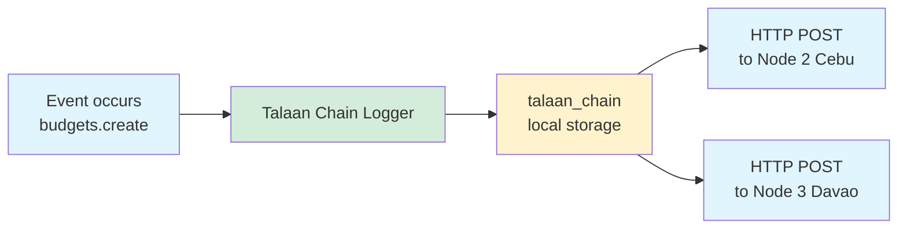
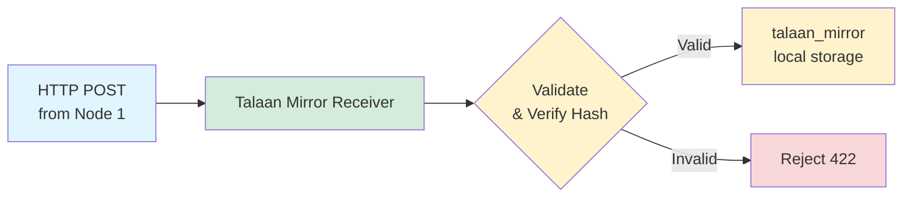

# Multi-Node Architecture

Complete guide for distributed Talaan Chain system across multiple nodes.

---

## 🌐 Overview

```
┌──────────────────────┐       ┌──────────────────────┐       ┌──────────────────────┐
│   Node 1 (Manila)    │       │   Node 2 (Cebu)      │       │   Node 3 (Davao)     │
│                      │       │                      │       │                      │
│  talaan_chain ───────┼──────→│  talaan_mirror       │       │  talaan_mirror       │
│  (creates own)       │   │   │  (receives Manila)   │       │  (receives Manila)   │
│                      │   │   │                      │       │                      │
│  talaan_mirror       │←──┼───│  talaan_chain ───────┼──────→│  talaan_mirror       │
│  (receives others)   │   │   │  (creates own)       │   │   │  (receives Cebu)     │
│                      │   │   │                      │   │   │                      │
│                      │←──┼───┼──────────────────────┼───┘   │  talaan_chain        │
│                      │   └───┼──────────────────────┼──────→│  (creates own)       │
└──────────────────────┘       └──────────────────────┘       └──────────────────────┘
```

**Key Concept:** Every node creates entries in `talaan_chain` and receives copies in `talaan_mirror`.

---

## 📊 Two Collections Per Node

### `talaan_chain` - Source/Original

**Purpose:** Stores entries **created by THIS node**

**Fields:**
- `id` - Database ID (local, auto by Directus)
- `talaan_id` - Global ledger ID (auto by Directus)
- `parent_id` - Parent's `talaan_id`
- `parent_hash` - Parent's hash
- `current_hash` - This entry's hash
- `payload` - Event data
- `date_created` - Timestamp

**Created by:** **Talaan Chain Logger** flow

**Example:** On Manila node, this contains all entries that Manila created.

---

### `talaan_mirror` - Replica/Copy

**Purpose:** Stores entries **received from OTHER nodes**

**Fields:** Same as `talaan_chain`

**Created by:** **Talaan Mirror Receiver** flow (via webhook)

**Example:** On Manila node, this contains entries from Cebu and Davao.

---

## 🔄 Flow Architecture

### Node 1 (Manila) - Creates Entry



---

### Node 2 (Cebu) - Receives Entry



---

## 🎯 Complete Data Flow

### Scenario: Manila Creates Entry

**Step 1: Manila Creates**
```
Manila Node:
  Event: budgets.create
  ↓
  Talaan Chain Logger runs
  ↓
  INSERT INTO talaan_chain:
  {
    talaan_id: "abc-123",
    parent_id: "xyz-789",
    current_hash: "a1b2c3d4",
    payload: {...}
  }
```

**Step 2: Manila Sends to Others**
```
Manila Node:
  ↓
  HTTP POST → Cebu:   /flows/trigger/[mirror-receiver-id]
  HTTP POST → Davao:  /flows/trigger/[mirror-receiver-id]
  
  Body: {
    talaan_id: "abc-123",
    parent_id: "xyz-789",
    parent_hash: "prev-hash",
    current_hash: "a1b2c3d4",
    payload: {...}
  }
```

**Step 3: Cebu & Davao Receive**
```
Cebu Node:
  Webhook receives POST
  ↓
  Talaan Mirror Receiver runs
  ↓
  Validates & verifies hash
  ↓
  INSERT INTO talaan_mirror:
  {
    talaan_id: "abc-123",  // Same global ID!
    parent_id: "xyz-789",
    current_hash: "a1b2c3d4",
    payload: {...}
  }

Davao Node: (Same process)
```

**Result:**
- Manila has entry in `talaan_chain`
- Cebu has copy in `talaan_mirror`
- Davao has copy in `talaan_mirror`

---

## 🔍 Validation Across Nodes

### Each Node Validates Its Own Data

```
Node Manila:
  Validates: talaan_chain + talaan_mirror
  
Node Cebu:
  Validates: talaan_chain + talaan_mirror
  
Node Davao:
  Validates: talaan_chain + talaan_mirror
```

**Important:** Validation queries should combine both collections:

```sql
-- Get ALL entries for validation (local + mirrored)
SELECT * FROM (
  SELECT * FROM talaan_chain
  UNION ALL
  SELECT * FROM talaan_mirror
) AS all_entries
ORDER BY date_created DESC;
```

Or in Directus Flow, validate each collection separately:
1. Validate `talaan_chain`
2. Validate `talaan_mirror`

---

## 🚀 Setup Guide

### Prerequisites

Each node needs:
1. ✅ Directus instance
2. ✅ `talaan_chain` collection
3. ✅ `talaan_mirror` collection (same schema)
4. ✅ Network connectivity between nodes

---

### Step 1: Create Collections

On **EACH node**, create both collections:

```
talaan_chain (Schema: see COLLECTION_SCHEMA_MULTINODE.md)
  - id (UUID, auto)
  - talaan_id (UUID, auto)
  - parent_id (UUID)
  - parent_hash (String)
  - current_hash (String)
  - payload (JSON)
  - date_created (Timestamp)

talaan_mirror (Same schema as talaan_chain)
```

---

### Step 2: Setup Logger Flow

On **EACH node**, create **Talaan Chain Logger**:

1. Event Hook trigger
2. Read parent entry
3. Generate chain entry (script)
4. Create entry in `talaan_chain`
5. **Read created entry** (to get `talaan_id`)
6. **Send to Node 2** (Webhook POST)
7. **Send to Node 3** (Webhook POST)
8. Log success

**Configuration for Node 1 (Manila):**
```
Operation 6: Send to Node 2
  URL: https://cebu.example.com/flows/trigger/[MIRROR-RECEIVER-ID]
  Body: Full entry with talaan_id

Operation 7: Send to Node 3
  URL: https://davao.example.com/flows/trigger/[MIRROR-RECEIVER-ID]
  Body: Full entry with talaan_id
```

**Configuration for Node 2 (Cebu):**
```
Operation 6: Send to Node 1
  URL: https://manila.example.com/flows/trigger/[MIRROR-RECEIVER-ID]
  
Operation 7: Send to Node 3
  URL: https://davao.example.com/flows/trigger/[MIRROR-RECEIVER-ID]
```

---

### Step 3: Setup Mirror Receiver Flow

On **EACH node**, create **Talaan Mirror Receiver**:

1. Webhook trigger (POST)
2. Validate & Verify Hash (script)
3. Condition (is_valid?)
4. Create entry in `talaan_mirror`
5. Webhook response

**Important:** Copy the webhook URL and share it with OTHER nodes!

---

### Step 4: Update Logger with Mirror URLs

On **Node 1**, update the webhook operations with URLs from:
- Node 2's Mirror Receiver webhook
- Node 3's Mirror Receiver webhook

Repeat for all nodes.

---

## 📋 Configuration Matrix

### 3-Node Setup Example

| Node | Logger Sends To | Mirror Receives From |
|------|----------------|---------------------|
| **Manila** | Cebu, Davao | Cebu, Davao |
| **Cebu** | Manila, Davao | Manila, Davao |
| **Davao** | Manila, Cebu | Manila, Cebu |

---

## 🧪 Testing Multi-Node Setup

### Test 1: Create on Node 1

```bash
# On Manila: Create a budget entry
POST /items/budgets
{
  "amount": 1000000,
  "department": "Education"
}

# Expected:
✅ Manila talaan_chain: 1 entry
✅ Cebu talaan_mirror: 1 entry (received)
✅ Davao talaan_mirror: 1 entry (received)
```

---

### Test 2: Create on Node 2

```bash
# On Cebu: Create a budget entry
POST /items/budgets
{
  "amount": 2000000,
  "department": "Health"
}

# Expected:
✅ Cebu talaan_chain: 1 entry
✅ Manila talaan_mirror: 1 entry (received)
✅ Davao talaan_mirror: 1 entry (received)
```

---

### Test 3: Verify All Nodes Have Complete Ledger

```sql
-- On Manila
SELECT 
  'talaan_chain' as source,
  COUNT(*) as count,
  MAX(date_created) as latest
FROM talaan_chain
UNION ALL
SELECT 
  'talaan_mirror' as source,
  COUNT(*) as count,
  MAX(date_created) as latest
FROM talaan_mirror;

-- Expected (if 2 entries total):
-- talaan_chain:  1 (Manila's own)
-- talaan_mirror: 1 (from Cebu)
```

---

## 🔐 Security Considerations

### 1. **Webhook Authentication**

Add API key validation in Mirror Receiver:

```javascript
// In validate_and_verify.js
const apiKey = $trigger.headers['x-api-key'];
if (apiKey !== 'your-secret-key') {
  return {
    valid: false,
    error: 'UNAUTHORIZED',
    status: 401
  };
}
```

---

### 2. **HTTPS Only**

```
❌ http://node2.com/flows/...
✅ https://node2.com/flows/...
```

---

### 3. **IP Whitelist**

Configure firewall to only accept webhooks from known node IPs.

---

### 4. **Rate Limiting**

Protect Mirror Receiver endpoint with rate limits (e.g., 100 req/sec per IP).

---

## 📊 Monitoring

### Check Replication Status

```sql
-- Count entries on each node
-- Expected: talaan_chain + talaan_mirror = TOTAL_ENTRIES across all nodes

-- Manila:
SELECT 
  (SELECT COUNT(*) FROM talaan_chain) as own,
  (SELECT COUNT(*) FROM talaan_mirror) as mirrored,
  (SELECT COUNT(*) FROM talaan_chain) + 
  (SELECT COUNT(*) FROM talaan_mirror) as total;

-- Should match on all nodes!
```

---

### Check for Missing Entries

```sql
-- Check if any talaan_id exists in chain but not in mirror
SELECT talaan_id FROM talaan_chain
WHERE talaan_id NOT IN (SELECT talaan_id FROM talaan_mirror);

-- Should be empty (unless entries haven't replicated yet)
```

---

## 🐛 Troubleshooting

### Issue: Entries not replicating

**Check:**
1. Logger webhook URLs are correct
2. Mirror Receiver flow is Active
3. Network connectivity between nodes
4. Firewall allows incoming webhooks
5. Check Directus logs for errors

---

### Issue: Duplicate key errors

**Cause:** Entry sent twice with same `talaan_id`

**Solution:** This is expected! Directus unique constraint prevents duplicates. The 409 error can be ignored.

---

### Issue: Hash mismatch

**Cause:** Different hash computation on sender vs receiver

**Solution:** Ensure all nodes use same hash algorithm and `likha_genesis` constant.

---

## 📈 Performance

| Metric | Single-Node | 3-Node | 5-Node |
|--------|-------------|--------|--------|
| **Logger time** | 50ms | 200ms | 400ms |
| **Network calls** | 0 | 2 | 4 |
| **Storage per entry** | 1× | 3× | 5× |
| **Validation time** | 500ms | 500ms | 500ms |

**Note:** Logger sends webhooks async, so doesn't block user operations.

---

## ✅ Production Checklist

- [ ] All nodes have `talaan_chain` and `talaan_mirror` collections
- [ ] Both collections have `talaan_id` field (UUID, auto, unique)
- [ ] Logger flow configured with correct webhook URLs
- [ ] Mirror Receiver flow active on all nodes
- [ ] HTTPS enabled on all nodes
- [ ] Webhook authentication configured
- [ ] Firewall rules allow inter-node communication
- [ ] Monitoring setup to check replication status
- [ ] Test entries created and replicated successfully
- [ ] Validation flows running on all nodes

---

**Status:** ✅ Production Ready  
**Version:** 2.0 (Multi-Node)  
**Last Updated:** 2025-10-10

