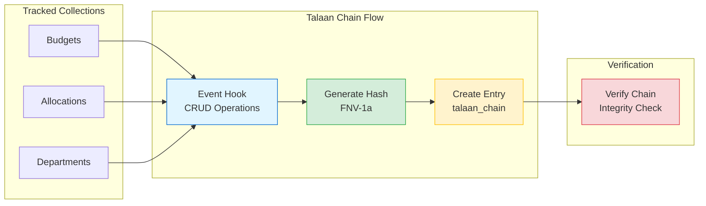
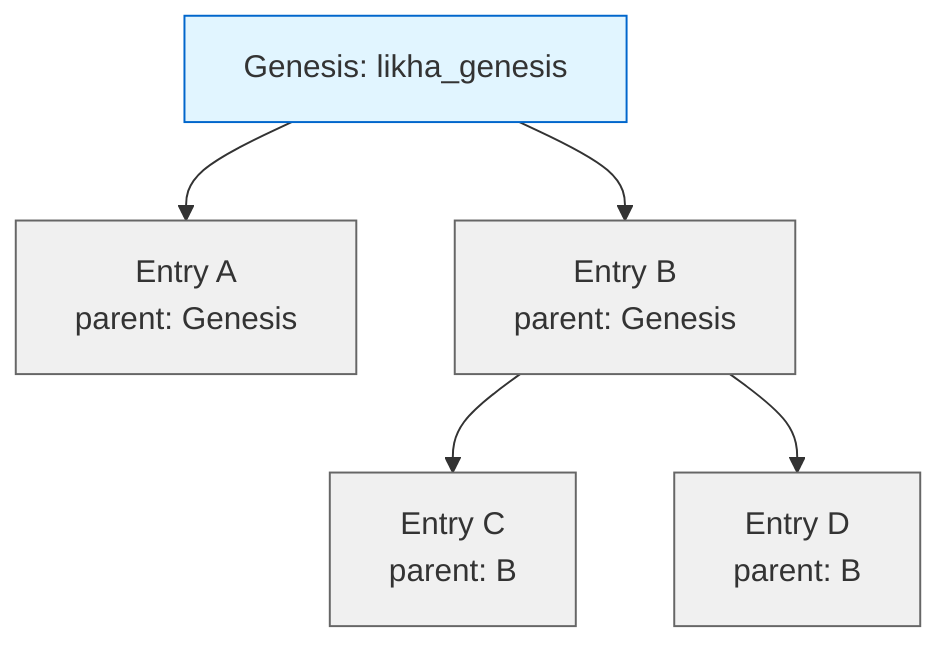

# Talaan Chain - Tamper-Evident Ledger System

**Tamper-evident ledger system for national budget transparency**, implementing the framework outlined in SB 1330 (Senate Bill 1330).

"Talaan" is Filipino for "list" or "ledger" - representing our commitment to transparent, immutable record-keeping for government budget operations.

---

## 📚 Documentation

| Document | Description |
|----------|-------------|
| **[COLLECTION_SCHEMA.md](COLLECTION_SCHEMA.md)** | Complete Directus collection setup guide with field definitions |
| **[ARCHITECTURE.md](ARCHITECTURE.md)** | Complete technical documentation, system design, and implementation details |
| **[MULTI_NODE_ARCHITECTURE.md](MULTI_NODE_ARCHITECTURE.md)** | 🌐 Multi-node/distributed setup guide with replication |
| **[VALIDATION_STRATEGIES.md](VALIDATION_STRATEGIES.md)** | Validation approaches, performance comparisons, and scheduling recommendations |
| **[flows/README.md](flows/README.md)** | Directus flows overview and quick start guide |

---

## 🚀 Quick Start

### 1. Create the Chain Logger Flow
Creates chain entries automatically on CRUD events.

📖 **Guide:** [flows/logger/README.md](flows/logger/README.md)

```
talaan-chain/flows/logger/
├── README.md                     # Complete setup guide
├── generate_chain_entry.js       # Hash generation script
├── read_parent_entry.json        # Parent entry query
└── create_chain_entry.json       # Create entry config
```

### 2. Create the Validator Flow
Validates chain integrity on-demand or scheduled.

📖 **Guide:** [flows/validator/README.md](flows/validator/README.md)

```
talaan-chain/flows/validator/
├── README.md                     # Complete setup guide
├── validate_latest_chain.js      # Quick validation (latest + 10 parents)
├── validate_random_sample.js     # Random sampling for audits
├── validate_recent_window.js     # Sliding window monitoring
└── verify_chain_tree.js          # Full chain verification
```

### 3. Test the System
1. Trigger an event on a tracked collection
2. Verify entry created in `talaan_chain`
3. Run validator to check integrity

---

## 🏗️ System Architecture

### Collections

| Collection | Purpose | Created By |
|------------|---------|------------|
| **`talaan_chain`** | Original entries created by THIS node | Talaan Chain Logger |
| **`talaan_mirror`** | Replicated entries from OTHER nodes | Talaan Mirror Receiver |

**Multi-Node Setup:** Each node has BOTH collections. Your `talaan_chain` = their `talaan_mirror`, and vice versa.

---

### Core Components



### Tree/DAG Structure

Uses a tree structure (not linear chain) to eliminate race conditions:



**Key Benefit:** Multiple entries can share the same parent = no race conditions!

---

## 📊 Performance

| Component | Performance | DB Queries |
|-----------|-------------|------------|
| **Chain Logger** | < 100ms per event | 2 (1 read, 1 write) |
| **Latest + Parents Validator** | < 0.5 sec | 1 (read 50) |
| **Random Sample Validator** | 2-5 sec | 1 (read all) |
| **Sliding Window Validator** | 1-2 sec | 2 (read 150) |
| **Full Chain Validator** | 5-60 sec | 1 (read all) |

---

## 🔒 Security Features

✅ **Tamper-Evident** - Any modification breaks the hash chain  
✅ **Deterministic Hashing** - Same data always produces same hash  
✅ **Tree Structure** - High concurrency without race conditions  
✅ **Fast Validation** - Multiple strategies for different needs  
✅ **Technology-Neutral** - Works with any database  

---

## 📁 Project Structure

```
talaan-chain/
├── README.md                      # This file
├── COLLECTION_SCHEMA.md           # Directus collection setup guide
├── ARCHITECTURE.md                # Complete technical documentation
├── VALIDATION_STRATEGIES.md       # Validation approaches
├── flows/                         # Directus flows
│   ├── README.md                  # Flows overview
│   ├── logger/                    # Chain creation flow
│   │   ├── README.md
│   │   ├── generate_chain_entry.js
│   │   ├── read_parent_entry.json
│   │   └── create_chain_entry.json
│   └── validator/                 # Validation flows
│       ├── README.md
│       ├── validate_latest_chain.js
│       ├── validate_latest_chain_enhanced.js
│       ├── validate_random_sample.js
│       ├── validate_recent_window.js
│       ├── verify_chain_tree.js
│       ├── talaan_incidents_schema.json
│       ├── check_status_condition.json
│       ├── condition_examples.json
│       └── ERROR_CODES.md
└── utils/
   └── hashJson.ts                # TypeScript hash utility
```

---

## 🎯 Use Cases

- **Budget Transparency** - Track all budget allocations and changes
- **Audit Trail** - Complete history of all modifications
- **Compliance** - Meet regulatory requirements (SB 1330)
- **Data Integrity** - Detect unauthorized changes
- **Public Accountability** - Transparent record of government spending

---

## 🔧 Technical Highlights

### Hash Algorithm: FNV-1a
- Non-cryptographic (optimized for speed)
- 32-bit hash → 8 hex characters
- Deterministic JSON serialization
- ~10-100x faster than SHA-256

### Tree/DAG Structure
- Multiple children can share same parent
- No race conditions
- High concurrency support
- Like Git commit history

### Validation Strategies
- **Latest + Parents**: Quick health check (< 0.5 sec)
- **Random Sample**: Statistical confidence (2-5 sec)
- **Sliding Window**: Continuous monitoring (1-2 sec)
- **Full Chain**: Comprehensive audit (5-60 sec)

---

## 📖 Getting Started

1. **Setup** `talaan_chain` collection using [COLLECTION_SCHEMA.md](COLLECTION_SCHEMA.md)
2. **Read** [ARCHITECTURE.md](ARCHITECTURE.md) for complete system overview
3. **Create** chain logger flow using [flows/logger/README.md](flows/logger/README.md)
4. **Create** validator flow using [flows/validator/README.md](flows/validator/README.md)
5. **Test** the system with sample data
6. **Deploy** to production collections

---

## 🤝 Support

For questions or issues:
1. Check [ARCHITECTURE.md](ARCHITECTURE.md) for detailed explanations
2. Review [VALIDATION_STRATEGIES.md](VALIDATION_STRATEGIES.md) for validation options
3. See flow-specific README files for setup instructions

---

**Status:** ✅ Production Ready  
**Version:** 1.0  
**Last Updated:** 2025-10-10  
**License:** [Add your license]

