# Chain Validation Strategies

This document outlines practical validation approaches for the Talaan Chain system. **You don't need to validate the entire chain every time** - use these strategies based on your needs.

## Quick Reference

| Strategy | Frequency | Performance | Coverage | Script |
|----------|-----------|-------------|----------|--------|
| **Latest + Parents** | Hourly / On-demand | Very Fast (< 1s) | Recent activity | [`validate_latest_chain.js`](flows/validator/validate_latest_chain.js) |
| **Random Sample** | Daily / Weekly | Medium | Statistical | [`validate_random_sample.js`](flows/validator/validate_random_sample.js) |
| **Sliding Window** | Every 15-30 min | Fast | Recent N entries | [`validate_recent_window.js`](flows/validator/validate_recent_window.js) |
| **Full Chain** | Monthly / On-demand | Slow | Complete | [`verify_chain_tree.js`](flows/validator/verify_chain_tree.js) |

---

## Strategy 1: Latest Entry + Parent Chain ⭐

### Best For:
- Quick health checks
- On-demand verification
- Frequent monitoring
- User-triggered validation

### How It Works:


Validates the most recent entry and traces back 10 levels through parents.

### talaan_chain_system Flow Setup:

**Flow Name:** `validate_latest_chain`  
**Trigger:** Manual or Schedule (every hour)

**Operations:**
1. **read_recent_50**
   - Collection: `talaan_chain`
   - Query: `{ "sort": ["-created_at"], "limit": 50, "fields": ["id", "parent_id", "parent_hash", "current_hash", "payload"] }`
   - First entry is the latest, provides lookup for parent chain

2. **validate_script**
   - Type: Run Script
   - Script: Copy from [`validate_latest_chain.js`](flows/validator/validate_latest_chain.js)

3. **log_results**
   - Type: Log to Console
   - Message: `{{$validate_script.summary}}`

**Only 3 operations!** Simple and efficient.

### Example Output:
```json
{
  "status": "valid",
  "summary": "✅ Valid! Checked 10 entries (depth: 10) to genesis",
  "validated": 10,
  "invalid": [],
  "depth_reached": 10,
  "reached_genesis": true
}
```

---

## Strategy 2: Random Sampling

### Best For:
- Daily audits
- Statistical confidence
- Large chains (1000+ entries)
- Compliance reporting

### How It Works:


Randomly picks 10 entries and validates each one's complete chain to genesis.

### talaan_chain_system Flow Setup:

**Flow Name:** `validate_random_sample`  
**Trigger:** Schedule (daily at 2 AM)

**Operations:**
1. **read_all_entries**
   - Collection: `talaan_chain`
   - Query: `{ "limit": -1 }`

2. **validate_script**
   - Type: Run Script
   - Script: Copy from [`validate_random_sample.js`](flows/validator/validate_random_sample.js)

3. **log_results**
   - Type: Log to Console
   - Message: `{{$validate_script.summary}}`

4. **send_email_if_invalid** (Optional)
   - Type: Condition → Send Email
   - Condition: `$validate_script.status === 'invalid'`

### Example Output:
```json
{
  "status": "valid",
  "summary": "✅ Valid! Checked 10 random chains (2.5% coverage), 87 total validations",
  "total_entries": 400,
  "sample_size": 10,
  "chains_validated": 10,
  "chains_invalid": [],
  "coverage_percent": 2.5
}
```

---

## Strategy 3: Sliding Window

### Best For:
- Continuous monitoring
- Catching issues quickly
- Recent activity validation
- Moderate-traffic systems

### How It Works:


Validates only the most recent 100 entries (configurable).

### talaan_chain_system Flow Setup:

**Flow Name:** `validate_recent_window`  
**Trigger:** Schedule (every 30 minutes)

**Operations:**
1. **read_recent_100** (entries to validate)
   - Collection: `talaan_chain`
   - Query: `{ "sort": ["-created_at"], "limit": 100 }`

2. **read_recent_150** (for parent lookup - extra buffer)
   - Collection: `talaan_chain`
   - Query: `{ "sort": ["-created_at"], "limit": 150, "fields": ["id", "parent_id", "parent_hash", "current_hash", "payload"] }`

3. **validate_script**
   - Type: Run Script
   - Script: Copy from [`validate_recent_window.js`](flows/validator/validate_recent_window.js)

4. **log_results**
   - Type: Log to Console
   - Message: `{{$validate_script.summary}}`

### Example Output:
```json
{
  "status": "valid",
  "summary": "✅ Valid! Checked 100 recent entries",
  "window_size": 100,
  "validated": 100,
  "invalid": [],
  "orphans": []
}
```

---

## Strategy 4: Full Chain Validation

### Best For:
- Monthly comprehensive audits
- After system maintenance
- Before major releases
- Compliance requirements

### How It Works:
Validates every single entry in the chain - comprehensive but slow.

### talaan_chain_system Flow Setup:

Use the existing [`verify_chain_tree.js`](flows/validator/verify_chain_tree.js) script.

**Flow Name:** `validate_full_chain`  
**Trigger:** Manual or Schedule (monthly)

---

## Recommended Validation Schedule

```mermaid
gantt
    title Chain Validation Schedule
    dateFormat HH:mm
    axisFormat %H:%M
    
    section Continuous
    Sliding Window (100 entries)    :00:00, 30m
    Sliding Window (100 entries)    :00:30, 30m
    
    section Hourly
    Latest + Parents (10 levels)    :01:00, 5m
    
    section Daily
    Random Sample (10 chains)       :02:00, 10m
    
    section Monthly
    Full Chain Validation           :crit, 03:00, 60m
```



### Suggested Schedule:

| Time | Validation | Purpose |
|------|------------|---------|
| **Every 30 min** | Sliding Window (100 entries) | Quick health check |
| **Every hour** | Latest + Parents (10 levels) | Recent activity validation |
| **Daily 2 AM** | Random Sample (10 chains) | Statistical audit |
| **Monthly** | Full Chain | Comprehensive verification |
| **On-demand** | Any strategy | User-triggered, troubleshooting |

---

## Performance Comparison

For a chain with **1,000 entries**:

| Strategy | Entries Read | Entries Validated | Time | DB Queries |
|----------|-------------|-------------------|------|------------|
| Latest + Parents | 50 | ~10 | < 0.5 sec | 1 ✅ |
| Random Sample | 1,000 | ~10 chains (~100 total) | 2-5 sec | 1 |
| Sliding Window | 150 | 100 | 1-2 sec | 2 |
| Full Chain | 1,000 | 1,000 | 5-10 sec | 1 |

For a chain with **10,000 entries**:

| Strategy | Entries Read | Entries Validated | Time | DB Queries |
|----------|-------------|-------------------|------|------------|
| Latest + Parents | 50 | ~10 | < 0.5 sec | 1 ✅ |
| Random Sample | 10,000 | ~10 chains (~150 total) | 3-8 sec | 1 |
| Sliding Window | 150 | 100 | 1-2 sec | 2 |
| Full Chain | 10,000 | 10,000 | 30-60 sec | 1 |

**Optimizations:**
- ✅ Latest + Parents: Only reads 50 recent entries (not all)
- ✅ Sliding Window: Only reads 150 recent entries (not all)
- ✅ Both strategies work efficiently regardless of total chain size!

---

## Customization

### Change Depth for Latest + Parents:
Edit `validate_latest_chain.js`:
```javascript
const TRACE_DEPTH = 20; // Validate last 20 levels instead of 10
```

### Change Sample Size:
Edit `validate_random_sample.js`:
```javascript
const SAMPLE_SIZE = 20; // Check 20 random chains instead of 10
```

### Change Window Size:
Edit `validate_recent_window.js`:
```javascript
const WINDOW_SIZE = 200; // Validate last 200 entries
```

Update both flow queries:
- **read_recent_100** → `{ "limit": 200 }`
- **read_recent_150** → `{ "limit": 250 }` (add 50 buffer for parents)

---

## Error Detection

### What Gets Detected:

✅ **Hash mismatch** - Entry has been tampered with  
✅ **Parent not found** - Chain is broken (orphaned entry)  
✅ **Parent hash mismatch** - Parent reference is incorrect  
✅ **Invalid genesis** - First entry doesn't reference "likha_genesis"

### Response to Errors:

1. **Log immediately** - All errors are logged with details
2. **Alert admins** - Send email notification (configure in flow)
3. **Stop operations** - Optionally pause new entries until resolved
4. **Investigate** - Use full chain validation to find extent
5. **Restore** - From backup if necessary

---

## Summary

**For most use cases:**
1. Run **Sliding Window** every 30 minutes (automated)
2. Run **Latest + Parents** on-demand (manual button)
3. Run **Random Sample** daily (automated)
4. Run **Full Chain** monthly (automated)

This provides comprehensive coverage without performance impact! 🚀

