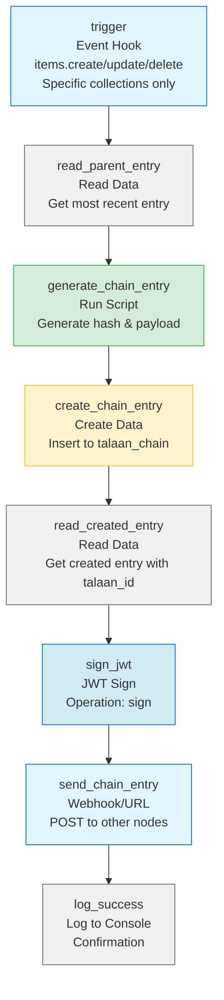

# talaan_chain_system Flow: Talaan Chain Logger

Automatically logs all CRUD events to the tamper-evident chain.

## Flow Configuration

| Setting | Value |
|---------|-------|
| **Name** | Talaan Chain Logger |
| **Status** | Active |
| **Trigger** | Event Hook |
| **Events** | `items.create`, `items.update`, `items.delete` |
| **Collections** | `budgets`, `allocations`, `departments` |
| **Async** | Yes (non-blocking) |

⚠️ **IMPORTANT:** Do NOT include `talaan_chain` in the collections list to prevent infinite loops!

---

## Flow Diagram



**Multi-Node:** Operations E, F, G are for distributed ledger. Skip if single-node.

**Security:** JWT signing (Operation F) ensures authenticated communication between nodes.

---

## Operations

### Operation 1: `trigger`

**Type:** Event Hook  
**Key:** `trigger`  
**Name:** Event Trigger

**Configuration:**
- Events: `items.create`, `items.update`, `items.delete`
- Collections: Select your tracked collections (e.g., `budgets`, `allocations`)
- **Exclude:** `talaan_chain` (prevents infinite loop)

---

### Operation 2: `read_parent_entry`

**Type:** Read Data  
**Key:** `read_parent_entry`  
**Name:** Get Parent Entry  
**Collection:** `talaan_chain`  
**Resolve:** `generate_chain_entry`

**Query Configuration:** See [`read_parent_entry.json`](read_parent_entry.json)

**Options:**
- emitEvents: `false`
- Permissions: Full Access

**What it does:** Reads the most recent chain entry to use as parent for the new entry.

---

### Operation 3: `generate_chain_entry`

**Type:** Run Script  
**Key:** `generate_chain_entry`  
**Name:** Generate Chain Entry  
**Resolve:** `create_chain_entry`

**Script:** Copy contents from [`generate_chain_entry.js`](generate_chain_entry.js)

**Input Variables:**
- `$trigger` - Event information
- `$accountability` - User and session info
- `read_parent_entry` - Parent entry data

**Output Variables:**
- `parent_id` - UUID of parent (or null for genesis)
- `parent_hash` - Hash of parent (or "likha_genesis")
- `current_hash` - Generated hash for this entry
- `payload` - Complete event data

**What it does:**
1. Gets parent entry from `read_parent_entry` (or uses genesis)
2. Builds payload with trigger and accountability data
3. Hashes payload using FNV-1a algorithm
4. Combines with parent hash to create current hash
5. Returns all data needed for chain entry

---

### Operation 4: `create_chain_entry`

**Type:** Create Data  
**Key:** `create_chain_entry`  
**Name:** Create Chain Entry  
**Collection:** `talaan_chain`  
**Resolve:** `log_success`

**Payload Configuration:** See [`create_chain_entry.json`](create_chain_entry.json)

**Options:**
- emitEvents: `false` (prevents triggering another flow)
- Permissions: Full Access

**What it does:** Inserts the new chain entry into the `talaan_chain` collection.

---

### Operation 5: `read_created_entry` (Multi-Node Only)

**Type:** Read Data  
**Key:** `read_created_entry`  
**Name:** Read Created Entry  
**Collection:** `talaan_chain`  
**Reject:** `log_success`  
**Resolve:** `send_to_node_*`

**Query:**
```json
{
  "filter": {
    "id": {
      "_eq": "{{$create_chain_entry.id}}"
    }
  },
  "limit": 1,
  "fields": ["id", "talaan_id", "parent_id", "parent_hash", "current_hash", "payload"]
}
```

**What it does:** Reads back the created entry to get the auto-generated `talaan_id` field for replication to other nodes.

**Note:** Skip this operation if you're running single-node (no replication needed).

---

### Operation 6: `sign_jwt` (Multi-Node)

**Type:** JSON Web Token (JWT)  
**Key:** `sign_jwt`  
**Operation:** `sign`  
**Purpose:** Signs the entry data with JWT for authenticated communication

**What it does:** Creates a cryptographically signed JWT token containing the entry data to be sent to other nodes.

**Payload to sign:**
```json
{
  "node_id": "manila",
  "entry": "{{$read_created_entry[0]}}"
}
```

**Configuration:**
- Secret: Shared across all nodes (configured in talaan_chain_system settings)
- Algorithm: HS256 (default)
- Expiration: 60 seconds (recommended for near-instant replication)

**Security Benefits:**
- ✅ Only nodes with correct secret can generate valid tokens
- ✅ Tamper-proof (signature verification)
- ✅ Token expiration prevents replay attacks
- ✅ Recipient can verify authenticity

**Important:** 
- All nodes must share the same JWT secret
- Keep secret in environment variables, not in code
- Rotate secret periodically for security

---

### Operation 7: `send_chain_entry` (Multi-Node)

**Type:** Webhook / Request URL  
**Key:** `send_chain_entry`  
**Name:** Send Chain Entry  
**Method:** POST

**Current Configuration:**
```
URL: http://localhost:8055/flow...
```

**Production URLs (when deploying to multiple nodes):**
```
https://node-2.example.com/flows/trigger/[MIRROR-RECEIVER-FLOW-ID]
https://node-3.example.com/flows/trigger/[MIRROR-RECEIVER-FLOW-ID]
```

⚠️ **Note:** Currently configured for `localhost` (testing). For production multi-node setup, add one webhook operation per remote node.

**Headers:**
```json
{
  "Content-Type": "application/json"
}
```

**Body:**
```json
"{{$sign_jwt}}"
```

**Or if JWT is in header:**
```
Headers:
  Authorization: Bearer {{$sign_jwt}}

Body:
{
  "talaan_id": "{{$read_created_entry[0].talaan_id}}",
  "parent_id": "{{$read_created_entry[0].parent_id}}",
  "parent_hash": "{{$read_created_entry[0].parent_hash}}",
  "current_hash": "{{$read_created_entry[0].current_hash}}",
  "payload": "{{$read_created_entry[0].payload}}"
}
```

**What it does:** Sends the JWT-signed entry to other nodes' Mirror Receiver webhook for secure replication.

**Important:**
- ✅ Use `talaan_id` (global ID), NOT `id` (database ID)
- ✅ JWT token provides authentication
- ✅ Add one webhook operation per remote node
- ✅ Replace URL with actual node addresses
- ⚠️ Don't send to localhost (that's yourself!)
- ⚠️ Enable "Reject on Error" = false for async (non-blocking)

**Notes:**
- Skip these operations if single-node
- For 3-node system: Add 2 webhook operations (to other 2 nodes)
- For 5-node system: Add 4 webhook operations (to other 4 nodes)

---

### Operation 8: `log_success`

**Type:** Log to Console  
**Key:** `log_success`  
**Name:** Log Success

**Message:**
```
✅ Chain entry created
   Hash: {{$generate_chain_entry.current_hash}}
   Parent: {{$generate_chain_entry.parent_hash}}
   Collection: {{$trigger.collection}}
   Item: {{$trigger.key}}
```

**What it does:** Logs confirmation that the chain entry was successfully created.

---

## Testing

### 1. Initial Setup
1. Create the flow with all 5 operations
2. Set status to Active
3. Configure collections to track

### 2. Test Genesis Entry
1. Perform an action on a tracked collection (create/update/delete)
2. Check `talaan_chain` collection
3. Verify first entry has:
   - `parent_id`: `null`
   - `parent_hash`: `"likha_genesis"`
   - `current_hash`: 8-character hex
   - `payload`: Contains trigger and accountability data

### 3. Test Chain Entry
1. Perform another action
2. Check new entry has:
   - `parent_id`: Previous entry's ID
   - `parent_hash`: Previous entry's `current_hash`
   - `current_hash`: New 8-character hex
   - `payload`: New event data

### 4. Verify Logs
Check talaan_chain_system logs for:
```
✅ Chain entry created
   Hash: abc12345
   Parent: xyz98765
   Collection: budgets
   Item: [uuid]
```

---

## Troubleshooting

### Issue: Infinite Loop
**Symptom:** Flow keeps triggering itself continuously

**Solution:** Make sure `talaan_chain` is NOT in the collections list for the trigger.

---

### Issue: No Entries Created
**Symptom:** Events trigger but no chain entries appear

**Possible Causes:**
1. Flow is not Active
2. User doesn't have permissions to write to `talaan_chain`
3. Script has errors - check logs

**Solution:** 
- Set flow status to Active
- Grant Full Access permissions to flow operations
- Check console for script errors

---

### Issue: Parent Hash Always "likha_genesis"
**Symptom:** All entries show genesis hash as parent

**Possible Causes:**
1. `read_parent_entry` returns empty
2. Previous entry's `current_hash` is not being read

**Solution:**
- Verify `read_parent_entry` query is correct
- Check field permissions include `current_hash`
- Verify entries exist in `talaan_chain`

---

## Performance

- **Execution Time:** < 100ms per event
- **Database Queries:** 2 (1 read, 1 write)
- **Impact:** Minimal - runs asynchronously
- **Scalability:** Supports high-volume operations

---

## Security Considerations

### Permissions
All operations should run with **Full Access** permissions to ensure:
- Reading from `talaan_chain` works
- Writing to `talaan_chain` succeeds
- No permission-related failures

### Data Integrity
- `emitEvents: false` prevents cascading triggers
- Operations run in sequence (no race conditions in single flow)
- Hash computation is deterministic

### Monitoring
Monitor these metrics:
- Flow execution count
- Failed executions
- Average execution time
- Chain entry creation rate

---

## Related Documentation

- [VALIDATION_STRATEGIES.md](../../VALIDATION_STRATEGIES.md) - How to validate chain integrity
- [ARCHITECTURE.md](../../ARCHITECTURE.md) - Complete system documentation
- [flows/README.md](../README.md) - Flows overview

---

**Status:** ✅ Production Ready  
**Last Updated:** 2025-10-10  
**Version:** 1.0

