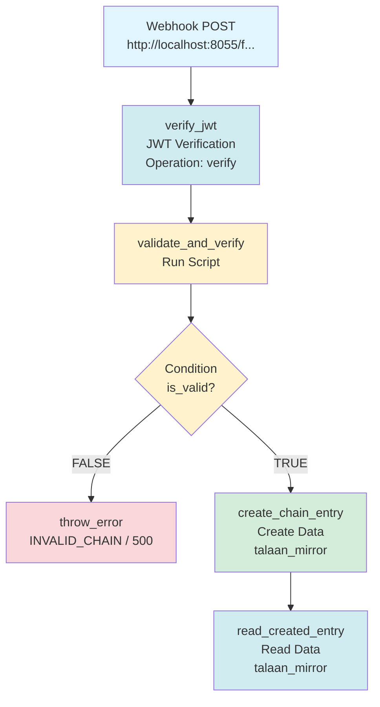

# Talaan Mirror Receiver Flow

**Purpose:** Receives entries from other nodes via webhook and stores them in `talaan_mirror` collection.

**Architecture:**
```
Node 1 (Manila)                          Node 2 (Cebu)
━━━━━━━━━━━━━━━                          ━━━━━━━━━━━━━━━
Talaan Chain Logger                      Talaan Mirror Receiver
  creates entry                            receives entry
      ↓                                         ↓
  talaan_chain ──── HTTP POST ────→      talaan_mirror
  (original)         webhook              (replicated copy)
```

**This flow runs on EACH node** to receive entries from OTHER nodes.

---

## Flow Overview

```
Webhook → Verify JWT → Validate & Verify → Condition → Create Entry → Read Entry
             ↓                                  ↓
        Unauthorized                      Throw Error (if invalid)
```

**Security:** JWT authentication ensures only authorized nodes can send entries.

---

## Operations

### 1. **Webhook Trigger**
- **Type:** Webhook
- **Method:** POST
- **Path:** `/talaan/mirror` (or `/webhooks/talaan-mirror-receiver`)
- **Key:** `webhook_trigger`

---

### 2. **Verify JWT** (JSON Web Token)
- **Key:** `verify_jwt`
- **Operation:** `verify`
- **Purpose:** Authenticates incoming requests from other nodes

**What it does:** Verifies the JWT token from the request to ensure it comes from an authorized node.

**Security Benefits:**
- ✅ Only authorized nodes can send entries
- ✅ Tamper-proof token (cryptographically signed)
- ✅ Token expiration prevents replay attacks
- ✅ Audit trail (who sent the entry)

**Configuration:**
- Secret: Shared across all nodes (configured in Directus settings)
- Algorithm: HS256 (default)
- Token location: Authorization header or request body

**Important:** All nodes must share the same JWT secret!

---

### 3. **Validate & Verify Hash** (Combined Script)
- **Key:** `validate_and_verify`
- **File:** `validate_and_verify.js`
- **Purpose:** Validates payload structure AND verifies hash in one step

**Checks:**
- ✅ Required fields present
- ✅ UUID format for `talaan_id`
- ✅ Hash format (8-char hex)
- ✅ Payload is valid JSON object
- ✅ Recompute hash and verify it matches

---

### 4. **Condition: Valid?**
- **Key:** `is_valid`
- **Rule:** `{{$validate_and_verify.valid}} == true`
- **TRUE:** Create mirror entry
- **FALSE:** Return error response

---

### 5. **Create Mirror Entry** (Create Data)
- **Key:** `create_chain_entry`
- **Collection:** `talaan_mirror`
- **Config:** `create_mirror_entry.json`
- **Purpose:** Insert entry into mirror collection
- **Resolve:** `read_created_entry`

**Note:** If entry already exists (duplicate `talaan_id`), Directus will return error due to unique constraint.

---

### 6. **Throw Error** (Throw Error)
- **Key:** `throw_error`
- **Error Code:** `INVALID_CHAIN`
- **HTTP Status Code:** `500`
- **Error Message:** `INVALID_CHAIN`
- **Triggered when:** Condition is FALSE (invalid entry)

**Purpose:** Stops flow and returns error when validation fails.

---

### 7. **Read Created Entry** (Read Data)
- **Key:** `read_created_entry`
- **Collection:** `talaan_mirror`
- **Purpose:** Read back the created entry for confirmation
- **IDs:** `{{create_chain_entry[0]}}`

**Query:**
```json
{
  "filter": {
    "id": {
      "_eq": "{{$create_chain_entry.id}}"
    }
  },
  "limit": 1
}
```

**Purpose:** Confirms entry was created successfully and retrieves full entry data.

---

## Complete Flow Sequence



**Key:** 
- ✅ Green = Success/Data operations
- ❌ Red = Error path
- 🔵 Blue = External trigger/Authentication
- ⚠️ Yellow = Processing/Validation

**7 operations total** - Webhook receiver with JWT authentication, validation, and error handling.

---

## Testing

### Test 1: New Entry (Should Create)

```bash
curl -X POST http://your-directus/flows/trigger/[flow-id] \
  -H "Content-Type: application/json" \
  -d '{
    "talaan_id": "550e8400-e29b-41d4-a716-446655440000",
    "parent_id": "123e4567-e89b-12d3-a456-426614174000",
    "parent_hash": "a1b2c3d4",
    "current_hash": "e5f6g7h8",
    "payload": {
      "$trigger": {
        "event": "test.items.create"
      },
      "$accountability": {
        "user": "test-user"
      }
    }
  }'
```

**Expected:** 201 Created

---

### Test 2: Duplicate Entry (Should Return OK)

```bash
# Send same request again
```

**Expected:** 200 OK (already exists)

---

### Test 3: Invalid Hash (Should Reject)

```bash
curl -X POST http://your-directus/flows/trigger/[flow-id] \
  -H "Content-Type: application/json" \
  -d '{
    "talaan_id": "550e8400-e29b-41d4-a716-446655440001",
    "parent_id": null,
    "parent_hash": "likha_genesis",
    "current_hash": "wronghash",
    "payload": {
      "$trigger": {
        "event": "test.items.create"
      }
    }
  }'
```

**Expected:** 422 Unprocessable Entity

---

### Test 4: Missing Fields (Should Reject)

```bash
curl -X POST http://your-directus/flows/trigger/[flow-id] \
  -H "Content-Type: application/json" \
  -d '{
    "talaan_id": "550e8400-e29b-41d4-a716-446655440002"
  }'
```

**Expected:** 400 Bad Request

---

## Webhook URL

After creating the flow, Directus will generate a webhook URL:

```
https://your-directus-instance.com/flows/trigger/[FLOW-UUID]
```

**Share this URL with other nodes** so they can send entries to your mirror.

---

## Security Considerations

### 1. **Add Authentication** (Recommended)

Add a "Condition" operation after webhook trigger:

```javascript
// Check for API key or JWT token
{{$trigger.headers.x-api-key}} == "your-secret-key"
```

### 2. **Rate Limiting**

Configure rate limiting in Directus or use a reverse proxy (nginx, Cloudflare).

### 3. **IP Whitelist**

Only accept requests from known node IPs:

```javascript
{{$trigger.headers.x-forwarded-for}} in ["192.168.1.100", "192.168.1.101"]
```

### 4. **Payload Size Limit**

Set max payload size in Directus config:

```env
DIRECTUS_MAX_PAYLOAD_SIZE=10mb
```

---

## Monitoring

### Check Mirror Status

```sql
-- Count mirrored entries
SELECT COUNT(*) FROM talaan_mirror;

-- Latest mirrored entry
SELECT * FROM talaan_mirror 
ORDER BY date_created DESC 
LIMIT 1;

-- Check for gaps in talaan_id
SELECT talaan_id, date_created 
FROM talaan_mirror 
ORDER BY date_created DESC 
LIMIT 100;
```

---

## Error Handling

| Error Code | Meaning | Action |
|------------|---------|--------|
| 400 | Invalid payload | Fix request format |
| 409 | Hash conflict | Investigate tampering |
| 422 | Hash verification failed | Check hash computation |
| 500 | Server error | Check Directus logs |

---

## Performance

- **Average processing time:** < 100ms
- **Database operations:** 1-2 (check + create)
- **Recommended throughput:** < 1000 req/sec per node

---

## Troubleshooting

### Issue: Entries not being created

**Check:**
1. Webhook URL is correct
2. Request has valid JSON
3. All required fields present
4. talaan_id is unique UUID

### Issue: Hash mismatch errors

**Check:**
1. Payload is not modified in transit
2. JSON serialization is deterministic
3. Using same hash algorithm (FNV-1a)

### Issue: Performance slow

**Solutions:**
1. Add indexes on `talaan_id`
2. Batch webhook calls
3. Use async processing

---

**Status:** ✅ Production Ready  
**Last Updated:** 2025-10-10

