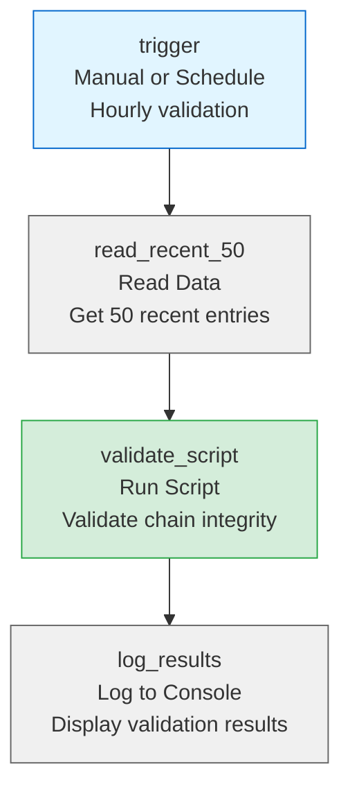
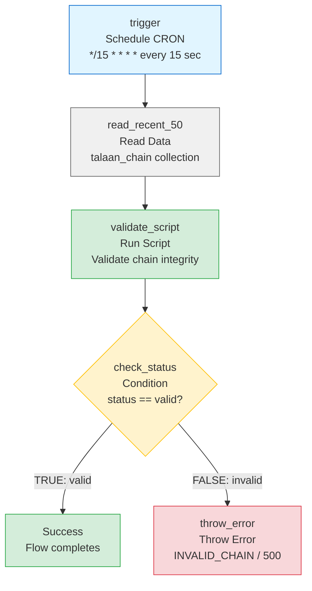

# Directus Flow: Talaan Chain Monitor

Quick validation of latest entry plus 10 parent levels for chain integrity checking.

## Flow Configuration

| Setting | Value |
|---------|-------|
| **Name** | Talaan Chain Monitor |
| **Status** | Active |
| **Trigger** | Schedule (CRON) |
| **Schedule** | `*/15 * * * *` (every 15 seconds) |
| **Async** | No (wait for results) |

---

## Flow Diagram

### Basic Flow (Logging Only)



**3 operations** - Simple logging flow.

---

### Current Flow (As Configured) ⭐



**5 operations** - Validation with error throwing on failure.

---

## Which Flow Should I Use?

| Feature | Basic (3 ops) | Enhanced (5 ops) |
|---------|---------------|------------------|
| **Logs results** | ✅ Console only | ✅ Console with details |
| **Detects errors** | ✅ In logs | ✅ Active detection |
| **Creates incidents** | ❌ No | ✅ Yes |
| **Tracks failures** | ❌ Manual | ✅ Automatic |
| **Alerts team** | ❌ No | ✅ Optional (add email/webhook) |
| **Best for** | Testing/dev | **Production** ⭐ |

**Recommendation:** Start with **Basic** for testing, upgrade to **Enhanced** for production.

---

## Operations (Basic Flow)

### Operation 1: `trigger`

**Type:** Manual or Schedule  
**Key:** `trigger`  
**Name:** Trigger Validation

**For Manual Trigger:**
- Add a button in Directus admin UI
- Users can click to validate on-demand

**For Scheduled Trigger:**
- Cron: `0 * * * *` (every hour)
- Or: `0 */6 * * *` (every 6 hours)
- Or: `0 0 * * *` (daily at midnight)

---

### Operation 2: `read_recent_50`

**Type:** Read Data  
**Key:** `read_recent_50`  
**Name:** Read Recent 50 Entries  
**Collection:** `talaan_chain`  
**Resolve:** `validate_script`

**Query:**
```json
{
  "sort": ["-created_at"],
  "limit": 50,
  "fields": ["id", "parent_id", "parent_hash", "current_hash", "payload"]
}
```

**Options:**
- Permissions: Full Access

**What it does:** Reads the 50 most recent chain entries. The first entry is the latest, and the list provides parent lookup for validation.

**Why 50?** Sufficient to trace back 10 parent levels plus buffer for tree structure.

---

### Operation 3: `validate_script`

**Type:** Run Script  
**Key:** `validate_script`  
**Name:** Validate Chain  
**Resolve:** `check_status` (enhanced) or `log_results` (basic)

**Script:** Copy contents from [`validate_latest_chain.js`](validate_latest_chain.js)

**Input Variables:**
- `read_recent_50` - Array of recent chain entries

**Output Variables:**
- `status` - `"valid"`, `"invalid"`, or `"empty"`
- `summary` - Human-readable summary message
- `validated` - Number of entries validated
- `invalid` - Array of invalid entries with reasons
- `depth_reached` - How many levels back were checked
- `reached_genesis` - Boolean, true if traced to genesis

**What it does:**
1. Takes the first entry from `read_recent_50` (latest)
2. Validates its hash computation
3. Traces back through parents up to 10 levels
4. Validates each parent's hash and relationship
5. Stops at genesis or after 10 levels
6. Returns detailed results

**Validation Checks:**
- ✅ Hash integrity - Each entry's hash is correctly computed
- ✅ Parent relationship - Parent exists and hash matches
- ✅ Genesis validation - Proper genesis entry with `parent_id = null`

---

### Operation 4: `log_results`

**Type:** Log to Console  
**Key:** `log_results`  
**Name:** Log Validation Results

**Message:**
```
{{$validate_script.summary}}

Status: {{$validate_script.status}}
Validated: {{$validate_script.validated}} entries
Depth Reached: {{$validate_script.depth_reached}}
Reached Genesis: {{$validate_script.reached_genesis}}
Invalid Entries: {{$validate_script.invalid}}
```

**What it does:** Displays validation results in Directus logs.

---

## Enhanced Operations (Error Handling) ⭐

Add these operations for active error detection and incident tracking.

### Operation 4 (Enhanced): `check_status`

**Type:** Condition  
**Key:** `check_status`  
**Name:** Check Validation Status

**Condition (Simple Expression - Recommended):**
```
{{$validate_script.status}} == "valid"
```

**Or using Filter JSON:**
```json
{
  "$validate_script": {
    "status": {
      "_eq": "valid"
    }
  }
}
```

**Reference Files:**
- [`check_status_condition.json`](check_status_condition.json) - Basic configuration
- [`condition_examples.json`](condition_examples.json) - All examples and alternatives

**Rules:**
- If TRUE (valid) → Go to `log_success` ✅
- If FALSE (invalid) → Go to `log_error` ❌

**What it does:** Branches flow based on validation result - no additional script needed!

**Note:** Configure directly in Directus UI. The JSON files are for reference only.

---

### Operation 5a: `log_success`

**Type:** Log to Console  
**Key:** `log_success`  
**Name:** Log Success

**Message:**
```
✅ CHAIN VALID

Status: {{$validate_script.status}}
Validated: {{$validate_script.validated}} entries
Depth: {{$validate_script.depth_reached}}
Genesis: {{$validate_script.reached_genesis}}
Timestamp: {{$now}}
```

**What it does:** Logs successful validation with timestamp.

---

### Operation 5b: `log_error`

**Type:** Log to Console  
**Key:** `log_error`  
**Name:** Log Error  
**Level:** Error (Important!)  
**Resolve:** `create_incident`

**Message:**
```
❌ CHAIN INTEGRITY FAILURE DETECTED

Status: {{$validate_script.status}}
Invalid Entries: {{$validate_script.invalid.length}}
Summary: {{$validate_script.summary}}
Depth: {{$validate_script.depth_reached}}
Timestamp: {{$now}}

DETAILS:
{{$validate_script.invalid}}

ACTION REQUIRED: Immediate investigation
```

**What it does:** Logs error with full details for troubleshooting.

---

### Operation 6: `create_incident`

**Type:** Create Data  
**Key:** `create_incident`  
**Name:** Create Incident Record  
**Collection:** `talaan_incidents`

**Payload:**
```json
{
  "incident_type": "chain_validation_failure",
  "severity": "critical",
  "detected_at": "{{$now}}",
  "validation_status": "{{$validate_script.status}}",
  "summary": "{{$validate_script.summary}}",
  "invalid_count": {{$validate_script.invalid.length}},
  "invalid_entries": "{{$validate_script.invalid}}",
  "depth_reached": {{$validate_script.depth_reached}},
  "status": "open",
  "assigned_to": null
}
```

**Options:**
- emitEvents: `false`
- Permissions: Full Access

**What it does:** Creates a permanent incident record for tracking and investigation.

---

### Required: Create `talaan_incidents` Collection

Before using the enhanced flow, create this collection.

**Quick Import:** Use [`talaan_incidents_schema.json`](talaan_incidents_schema.json) to create the collection automatically.

**Manual Setup:**

| Field | Type | Description | Interface |
|-------|------|-------------|-----------|
| `id` | uuid | Primary Key | UUID |
| `incident_type` | string | Type of incident | Dropdown: `chain_validation_failure`, `hash_mismatch`, `missing_parent` |
| `severity` | string | Severity level | Dropdown: `critical`, `high`, `medium`, `low` |
| `detected_at` | timestamp | When detected | Datetime |
| `validation_status` | string | Status from validator | Input |
| `summary` | text | Summary message | Textarea |
| `invalid_count` | integer | Number of invalid entries | Input |
| `invalid_entries` | json | Full validation details | JSON |
| `depth_reached` | integer | Validation depth | Input |
| `status` | string | Incident status | Dropdown: `open`, `investigating`, `resolved`, `false_positive` |
| `assigned_to` | string | Who's investigating | Input or User relation |
| `resolved_at` | timestamp | Resolution time | Datetime |
| `resolution_notes` | text | How it was fixed | Textarea |
| `created_at` | timestamp | Auto | Datetime |
| `updated_at` | timestamp | Auto | Datetime |

**Display Template:** `{{incident_type}} - {{severity}} - {{detected_at}}`

---

## Example Outputs

### ✅ Valid Chain
```json
{
  "status": "valid",
  "summary": "✅ Valid! Checked 10 entries (depth: 10) to genesis",
  "validated": 10,
  "invalid": [],
  "depth_reached": 10,
  "reached_genesis": true
}
```

### ✅ Valid (Less than 10 entries)
```json
{
  "status": "valid",
  "summary": "✅ Valid! Checked 3 entries (depth: 3) to genesis",
  "validated": 3,
  "invalid": [],
  "depth_reached": 3,
  "reached_genesis": true
}
```

### ❌ Invalid Chain
```json
{
  "status": "invalid",
  "summary": "❌ Invalid! Found 1 errors at depth 2",
  "validated": 2,
  "invalid": [
    {
      "id": "abc-123",
      "depth": 2,
      "reason": "Hash mismatch"
    }
  ],
  "depth_reached": 3,
  "reached_genesis": false
}
```

### ⚠️ Empty Chain
```json
{
  "status": "empty",
  "message": "No entries in chain yet"
}
```

---

## Testing

### 1. Test with Clean Chain
1. Ensure you have 2-3 valid chain entries
2. Trigger the validator flow manually
3. Expected result: "✅ Valid! Checked N entries to genesis"

### 2. Test with Corrupted Entry
1. Manually edit a `current_hash` in database
2. Trigger validator
3. Expected result: "❌ Invalid! Hash mismatch at depth X"

### 3. Test with Broken Chain
1. Delete a middle entry from chain
2. Trigger validator
3. Expected result: "❌ Invalid! Parent not found"

### 4. Test with Empty Chain
1. Clear all entries from `talaan_chain`
2. Trigger validator
3. Expected result: "No entries in chain yet"

---

## Scheduling Recommendations

### For Different Use Cases:

| Traffic Level | Schedule | Reason |
|--------------|----------|--------|
| **High** (100+ events/day) | Every 15-30 min | Catch issues quickly |
| **Medium** (10-100 events/day) | Every hour | Balance detection and load |
| **Low** (< 10 events/day) | Every 6 hours | Sufficient coverage |
| **On-demand** | Manual only | For troubleshooting |

### Cron Examples:

```bash
0 * * * *          # Every hour
0 */6 * * *        # Every 6 hours
0 0,12 * * *       # Twice daily (midnight and noon)
0 2 * * *          # Daily at 2 AM
0 0 * * 0          # Weekly on Sunday
```

---

## Advanced Configuration

### Email/Webhook Alerts on Failure

For production deployments, add notification operations after `create_incident`:

#### **Operation 7: send_alert_email** (Optional)

**Type:** Send Email or Webhook  
**Key:** `send_alert_email`  
**Name:** Send Alert

**For Email:**
- **To:** COA audit team, system administrators
- **Subject:** `🚨 [CRITICAL] Chain Validation Failed`
- **Body:**
```
CHAIN INTEGRITY FAILURE DETECTED

Incident ID: {{$create_incident.id}}
Detected: {{$now}}
Status: {{$validate_script.status}}
Invalid Entries: {{$validate_script.invalid.length}}

Summary:
{{$validate_script.summary}}

Details available in Directus:
https://your-directus.com/admin/content/talaan_incidents/{{$create_incident.id}}

ACTION REQUIRED: Immediate investigation
```

**For Webhook (Slack/Discord/Teams):**
- **URL:** Your webhook URL
- **Method:** POST
- **Body:**
```json
{
  "alert_type": "chain_integrity_failure",
  "severity": "critical",
  "timestamp": "{{$now}}",
  "summary": "{{$validate_script.summary}}",
  "invalid_count": {{$validate_script.invalid.length}},
  "incident_id": "{{$create_incident.id}}",
  "details_url": "https://your-directus.com/admin/content/talaan_incidents/{{$create_incident.id}}"
}
```

---

### Store Validation Results

Create a `chain_validations` collection to track validation history:

**Collection Schema:**
```
- id (UUID)
- validated_at (timestamp)
- status (string: valid/invalid/empty)
- entries_validated (integer)
- depth_reached (integer)
- reached_genesis (boolean)
- errors (json)
- created_at (timestamp)
```

**Add operation:**
**Type:** Create Data  
**Collection:** `chain_validations`  
**Payload:**
```json
{
  "validated_at": "{{$now}}",
  "status": "{{$validate_script.status}}",
  "entries_validated": "{{$validate_script.validated}}",
  "depth_reached": "{{$validate_script.depth_reached}}",
  "reached_genesis": "{{$validate_script.reached_genesis}}",
  "errors": "{{$validate_script.invalid}}"
}
```

This creates an audit trail of all validations.

---

## Performance

| Metric | Value |
|--------|-------|
| **Execution Time** | < 0.5 seconds |
| **Database Queries** | 1 (read 50 entries) |
| **Memory Usage** | Minimal (~1MB) |
| **Entries Validated** | 10 (or until genesis) |
| **Scalability** | Works efficiently regardless of total chain size |

**Why It's Fast:**
- Only reads 50 recent entries (not entire chain)
- Single database query
- Efficient hash computation (FNV-1a)
- No external dependencies

---

## Troubleshooting

### Issue: "Parent not found" Error
**Symptom:** Validation fails with parent not found at depth 0 or 1

**Possible Causes:**
1. Parent entry was deleted
2. Parent is older than 50 entries
3. `parent_id` references non-existent entry

**Solutions:**
- Check if parent entry exists: `SELECT * FROM talaan_chain WHERE id = 'parent-id'`
- Increase read limit to 100: `{ "limit": 100 }`
- Fix orphaned entry: Set `parent_id = NULL` if it should be genesis

---

### Issue: "Hash mismatch" Error
**Symptom:** Validation fails with hash mismatch

**Possible Causes:**
1. Entry was manually modified
2. Hash algorithm changed
3. Payload was corrupted

**Solutions:**
- Check entry in database: `SELECT * FROM talaan_chain WHERE id = 'entry-id'`
- Recompute hash manually to verify
- If valid change: Use full chain validation
- If corruption: Investigate data integrity

---

### Issue: Validation Never Reaches Genesis
**Symptom:** `reached_genesis: false` even with small chain

**Possible Causes:**
1. No entry with `parent_id = NULL` exists
2. Genesis entry has wrong `parent_hash` (not "likha_genesis")
3. Chain has cycles

**Solutions:**
- Find genesis: `SELECT * FROM talaan_chain WHERE parent_id IS NULL`
- Fix genesis entry if needed
- Use full chain validation to trace complete structure

---

## Comparison with Other Validation Strategies

| Strategy | Frequency | Entries Read | Validated | Time |
|----------|-----------|--------------|-----------|------|
| **Latest + Parents** (This) | Hourly / On-demand | 50 | ~10 | < 0.5s |
| Random Sample | Daily | All | ~100 | 2-5s |
| Sliding Window | Every 30 min | 150 | 100 | 1-2s |
| Full Chain | Monthly | All | All | 5-60s |

**Best for:**
- ✅ Quick health checks
- ✅ On-demand validation
- ✅ Hourly monitoring
- ✅ Minimal performance impact

**Not ideal for:**
- ❌ Comprehensive audits (use Full Chain)
- ❌ Statistical confidence (use Random Sample)
- ❌ Continuous monitoring (use Sliding Window)

See [VALIDATION_STRATEGIES.md](../../VALIDATION_STRATEGIES.md) for complete comparison.

---

## Related Documentation

- [logger/README.md](../logger/README.md) - Chain creation flow
- [VALIDATION_STRATEGIES.md](../../VALIDATION_STRATEGIES.md) - All validation approaches
- [ARCHITECTURE.md](../../ARCHITECTURE.md) - Complete system documentation
- [flows/README.md](../README.md) - Flows overview

---

**Status:** ✅ Production Ready  
**Performance:** < 0.5 sec, 1 DB query  
**Last Updated:** 2025-10-10  
**Version:** 1.0

